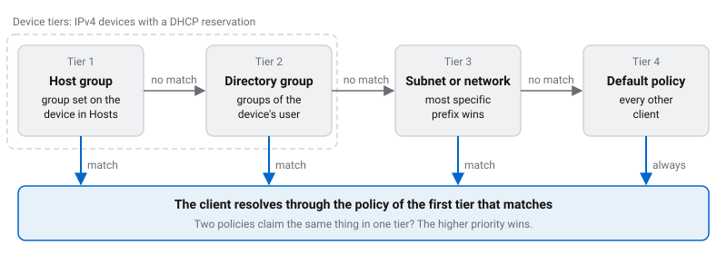

# Access policies

Access policies are the router's DNS content filter. You build named policies, each a set of block lists, categories and allow or block rules, and assign them to groups of clients: a network, a subnet, a group of devices, or a group of people in your directory. Every client that uses the router for DNS resolves through exactly one policy.

Filtering runs in Technitium DNS Server on the router, in its Advanced Blocking app. You manage it on the **Access Policies** page in Cockpit, or in the `accessPolicies` key of the [settings file](/docs/start/settings-file/).

## Concepts

- **Policy:** a named set of filters. It combines [UT Capitole categories](/docs/access-policies/policies/#categories), standard ad, malware and phishing lists, your own list URLs, and per-domain allow and block rules. It also sets how a blocked query is answered. See [Build a policy](/docs/access-policies/policies/).
- **Assignment:** which clients a policy applies to. A policy can be assigned to networks (LAN, guest, WireGuard), subnets, host groups from the Hosts page, and directory groups. See [Assign policies](/docs/access-policies/assignments/).
- **Default policy:** the policy for every client no assignment matches. There is always exactly one, and it can't be deleted while it is the default.
- **Priority:** a number on each policy. It only breaks ties between policies that match a client at the same tier. Higher wins.
- **The Base policy:** when you have defined no policies, the router creates one named **Base** and makes it the default. Base blocks ads, malware and phishing with three standard filters: **AdGuard Base (ads & trackers)**, **AdGuard Malware** and **AdGuard Phishing URL Blocklist**. It answers blocked queries with a blocking address. As soon as you add a policy of your own, Base is no longer created for you. See [Your first policy replaces Base](/docs/access-policies/policies/#your-first-policy-replaces-base).

## Which policy a client gets

For each client, the router works down four tiers and stops at the first one that matches:

1. **Host group:** the device is registered on the Hosts page with a static IP and a group, and a policy targets that group.
2. **Directory group:** the device is registered with a static IP and a user, and a policy targets one of that user's directory groups.
3. **Subnet or network:** a policy is assigned to a subnet or network that contains the client's address. The most specific prefix wins, so a `/28` beats the `/24` it sits in.
4. **Default policy:** everything else.

The first two tiers work only for IPv4 devices with a DHCP reservation. [Assign policies](/docs/access-policies/assignments/) covers each tier, the role of priority, and the **Preview** tab that shows which policy a device would get.

:::doc-warning
Policies are a filter, not access control. The router identifies a device by its IPv4 address and nothing else. A device that sets another device's reserved address, or clones its MAC address to get that address from DHCP, gets that device's policy. The firewall's reverse-path check stops a guest device from claiming a LAN address, but it can't stop this within one network. Where it matters, pair a strict policy with switch-level controls such as port security or 802.1X.
:::

## Get started

1. [Build a policy](/docs/access-policies/policies/) for each group of clients that needs different rules, and pick the default.
2. [Assign the policies](/docs/access-policies/assignments/) to networks, subnets, host groups or directory groups, then check the result on the **Preview** tab.
3. Click **Save & apply**.
4. Optionally, turn on the [block page](/docs/access-policies/block-page/) so users see why a site is blocked and can ask for an exception.
5. Review [DNS enforcement](/docs/access-policies/dns-enforcement/) to understand which clients can and can't bypass the filter.

## How it works

1. **Settings to static policy.** When you apply a change, the build expands each policy's catalog choices (categories and standard filters) into list URLs, each tagged with its format. It writes them, together with the host registry, host group names and network ranges, to a generated file named `router-policy-static.json`.
2. **Compile and push.** `technitium-reconcile.service` merges that file with the synced directory state in `/var/lib/router-directory/directory.json`. It compiles the result into the Advanced Blocking app's configuration and pushes it through Technitium's HTTP API on `127.0.0.1`, only when it changed. The service runs after every apply that changes the router's DNS configuration.
3. **Directory changes without a rebuild.** A systemd path unit watches `directory.json`. When the directory sync rewrites it, `router-policy-push.service` recompiles and re-pushes only the Advanced Blocking configuration. See [Directory groups](/docs/access-policies/directory/).
4. **Lists and answers.** Advanced Blocking downloads every list URL itself and refreshes the lists every 24 hours. A blocked answer has a TTL of 30 seconds, so an unblocked domain starts working within half a minute once the new configuration is live.
5. **Extras in every policy.** While **Block DoH providers** is on, the router adds a list of public DNS-over-HTTPS resolver domains to every policy's block list. See [DNS enforcement](/docs/access-policies/dns-enforcement/).
6. **The router itself is not filtered.** Queries from the router's own loopback addresses use a built-in group with blocking turned off.

### How Technitium is set up

Technitium keeps its main configuration in a binary file, so the router can't generate it directly. Setup happens in three phases:

1. **First boot:** environment variables seed the configuration with the admin password from `/var/lib/router-technitium/admin.pass`, the upstream forwarders and the web console port. Technitium reads them only while it has no configuration yet.
2. **App seeding:** before the DNS server starts, the router copies the DNS apps into `/var/lib/technitium-dns-server/apps/`. The apps are Advanced Blocking, Log Exporter, Block Page and the router's own Router Live DNS app, all built from source with the router. Filtering is therefore active from the first second. The Block Page app also gets the branded page generated from your settings.
3. **Reconcile:** `technitium-reconcile.service` sets the server settings and the router's own zone. It also creates the [split-horizon](/docs/access-policies/dns-enforcement/#split-horizon-dns) and SafeSearch zones, sets each app's configuration (including the compiled policies), and creates the read-only API token the Cockpit dashboards use. It is idempotent and retries on failure.

Technitium's own web console listens on `127.0.0.1` only, port 5380 by default. You don't need it for day-to-day work. [Troubleshooting](/docs/access-policies/troubleshooting/#open-the-technitium-console) explains how to reach it.

Setting `dns.technitium.enable` to `false` turns off filtering, not DNS. See [When Technitium is off](/docs/access-policies/dns-enforcement/#when-technitium-is-off).

## In this section

- [Build a policy](/docs/access-policies/policies/): the policy editor, section by section.
- [Assign policies](/docs/access-policies/assignments/): networks, subnets, host groups and directory groups, precedence, and the **Preview** tab.
- [Block page and exceptions](/docs/access-policies/block-page/): the page blocked users see, and approving their exception requests.
- [DNS enforcement](/docs/access-policies/dns-enforcement/): how the router keeps clients on its resolver, SafeSearch, and split-horizon DNS.
- [Directory groups](/docs/access-policies/directory/): connecting LDAP or Active Directory so policies follow people.
- [Reports](/docs/access-policies/reports/): dashboards, the query log and scheduled PDF reports.
- [Troubleshooting](/docs/access-policies/troubleshooting/): symptoms, causes and fixes.
