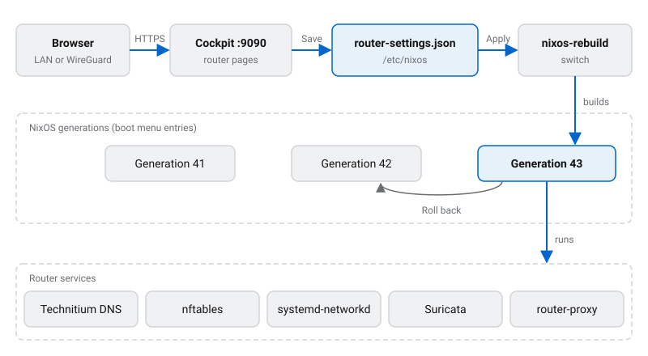

# Get started

nixos-router turns a machine with several network ports into a router for a small business, a school or a home lab. It is a NixOS module, plus a set of pages for the Cockpit web UI, so you manage the router in a browser and never need to write Nix for day-to-day work.

This section explains how the pieces fit together, then walks you through installing a router and learning the web UI.

## What the router does

- **Networks:** a DHCP WAN with IPv6 prefix delegation, a LAN, an isolated guest network, and VLANs.
- **Firewall:** nftables with NAT, and all DNS from the LAN and the guest network forced through the router.
- **DNS filtering:** Technitium DNS with per-device and per-group filtering policies, a block page and reports.
- **Ingress:** port forwards over IPv4 and IPv6, a reverse proxy with Let's Encrypt certificates, or a Cloudflare Tunnel.
- **Remote access:** WireGuard tunnels, and Cloudflare dynamic DNS for the router's changing addresses.
- **Optional extras:** a Suricata intrusion prevention system (IPS), and a UniFi or OpenWISP controller for your access points.

## How it works

A router's whole configuration lives in `/etc/nixos`, in two parts:

- **The host flake** (`flake.nix` and `flake.lock`) is a short Nix file that pulls in nixos-router and says where the settings are. You rarely touch it.
- **`router-settings.json`** holds every setting you see in the web UI: addresses, hosts, policies, port forwards and so on.

1. You open Cockpit at `https://<router>:9090` from the LAN, or over WireGuard at the router's LAN address.
2. The router's Cockpit pages read and write `router-settings.json`. Saving changes only the file; the router keeps running as before.
3. Applying runs `nixos-rebuild switch`. It builds a complete new system from the host flake and the settings file, then switches the running services to it.
4. Each build is a new NixOS **generation**. If a change goes wrong, switch back to the previous generation from the System page, or pick an older one in the boot menu.

Every night at `03:00` the router also updates nixos-router and rebuilds itself, so fixes and security updates arrive without anyone logging in. See [Upgrades and rollback](/docs/start/upgrades/).

A few settings are not in the web UI at all, such as Cockpit's own port and extra software packages. They live in the host flake, in Nix. Anything set there overrides the settings file, and the web UI shows those fields as locked.

## Hardware

- **An x86_64 machine.** The host flake template and the installer both target `x86_64-linux`. The flake also defines the router packages for `aarch64-linux`, but CI neither builds nor caches them, and there is no ARM installer or template, so an ARM router means adapting the host flake yourself.
- **Two or more Ethernet ports** is the usual setup: one for the WAN, the rest bridged into the LAN or the guest network. A single port also works if a VLAN-capable switch delivers each network to it as a tagged VLAN; see [Networks and VLANs](/docs/network/#vlans).
- **One disk.** The install erases it and creates a boot partition plus an f2fs root. The router boots with UEFI (systemd-boot) or legacy BIOS (GRUB).
- **No Wi-Fi radio is used.** Wireless comes from separate access points; the router can run a UniFi or OpenWISP controller to manage them.

The code sets no minimum CPU or memory. The heaviest parts are Technitium DNS, Suricata and the optional wireless controllers, so size the machine for the features you turn on.

## Where next

- [Install a router](/docs/start/install/): a network install over SSH, or an installer USB stick.
- [The web UI](/docs/start/cockpit/): signing in, saving and applying changes.
- [The settings file](/docs/start/settings-file/): what `router-settings.json` holds and how Nix reads it.
- [Upgrades and rollback](/docs/start/upgrades/): nightly upgrades, generations and recovery.
- [Networks and VLANs](/docs/network/) and [Hosts and host groups](/docs/network/hosts/): the foundations every other feature builds on.
- Features: [Access policies](/docs/access-policies/), [Threat protection](/docs/threat-protection/), [Ingress](/docs/ingress/), [WireGuard](/docs/wireguard/) and [Dynamic DNS](/docs/dynamic-dns/).
- [Ports and services](/docs/reference/ports/): everything the router listens on.
